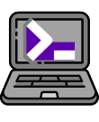
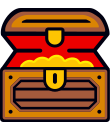
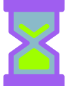

<div align="center">

# Nora OS

**Tu sistema operativo de vida — productividad, salud y foco en una sola app.**

100 % local · Multiusuario · Modular · Con IA opcional vía Ollama

`v1.10.0` · Electron 41 · React 19 · TypeScript 5.7 · SQLite

> **Nota de marca y compatibilidad**: el repositorio, las URLs derivadas (sitio en GitHub Pages, API de releases) y los identificadores internos (`appId`, `productName`, paquete npm) mantienen el slug histórico **`personal-os`** por compatibilidad. El nombre de marca de la aplicación es **Nora OS** y se refleja en toda la documentación. La unificación del slug queda fuera del alcance de esta refresh y se planificará como cambio de infraestructura aparte.

[](https://na7hk3r.github.io/personal-os/)
[](https://github.com/na7hk3r/personal-os/releases)
[](LICENSE)

[Sitio web](https://na7hk3r.github.io/personal-os/) · [Características](#características) · [Instalación](#instalación) · [Stack](#stack-técnico) · [Documentación](#documentación) · [Roadmap](#roadmap)

<br />

<p>
  
  
  
  
  
  
</p>

<sub>Identidad gráfica — set de iconos ilustrativos en <code>public/icons/</code> reutilizables en app, landing y docs.<br />Iconos por <a href="https://github.com/xero/svg-icons">xero/svg-icons</a> (CC0 / dominio público).</sub>

</div>

---

## ¿Qué es Nora OS?

Nora OS es una aplicación de escritorio modular que centraliza **lo que importa de tu día**: el trabajo que estás ejecutando, tus hábitos de salud, tu agenda y tus objetivos — con gamificación integrada para sostener la consistencia.

A diferencia de un dashboard de SaaS o una app cloud, **toda tu información vive en tu máquina**: una base de datos SQLite cifrable, sin servidores, sin telemetría, sin tracking. Si querés inteligencia sobre tus datos, conectás un modelo local con [Ollama](https://ollama.com) y listo — el LLM nunca sale de tu equipo.

> Pensado para una sola persona que quiere ordenar su vida con herramientas serias, sin alquilar diez SaaS distintos.

---

## Características

### 🎯 Núcleo de productividad

- **Planner core** — tareas diarias, semanales y mensuales con drag & drop entre días y misión diaria gamificada.
- **Calendario unificado** — agrega vencimientos de Work, entrenamientos de Fitness, sesiones de foco y tareas del Planner en una vista mensual con filtros por fuente.
- **Command Palette (`Ctrl/Cmd + K`)** — búsqueda global instantánea sobre notas, tareas, enlaces y rutas (incluye páginas de plugins activos).
- **Catálogo de atajos in-app** — página `/shortcuts` con todos los keybindings agrupados y buscables, sincronizada con `docs/SHORTCUTS.md`.
- **Review semanal/mensual** — KPIs reales (fitness, work, gamificación) con análisis IA opcional para cerrar la semana.
- **Accesibilidad** — skip-link, landmarks ARIA, command palette como combobox/listbox real, toasts con `role="alert"` para errores y modales con `aria-modal`.

### 🤖 IA local con Ollama (privacidad total)

- Integración por canal IPC con `http://127.0.0.1:11434` (sin CORS, sin telemetría).
- Tareas predefinidas: **coach diario**, **review semanal**, **nudge de foco** — en español rioplatense, sin emojis.
- **Daily Brief** — una línea accionable cada mañana, cacheada por día, con fallback determinístico cuando Ollama está off.
- **Smart Focus Nudge** — si llevás 45 s en `/work` sin actividad y la última sesión de foco fue hace más de 4 h, la app te ofrece arrancar foco con la tarea más prioritaria. Una vez por sesión de la app.
- **Note → Task** — desde el editor de Notas extraés tareas accionables a Kanban con un click (requiere Ollama).
- El servicio `aiContextService` arma un snapshot real de tu actividad (fitness 7d, work, planner, gamificación, eventos recientes) y lo entrega al LLM como contexto.
- **Registry de proveedores de contexto** (`registerAIContextProvider`): cada plugin aporta su slice al snapshot sin que el core lo conozca.
- Configurable desde Control Center: enable, modelo, system prompt, temperatura.

### 🧱 Plugins

Sistema de plugins de primera clase. Hoy vienen incluidos **8 plugins oficiales**:

| Plugin | Dominio | Qué resuelve |
| --- | --- | --- |
| **Work** | productivity | Kanban con prioridades, estimaciones, checklists, vencimientos, WIP limit, archivado automático. Notas y enlaces con búsqueda y pin. **Focus Engine 2.0** con pause/resume reales, Pomodoro configurable, notificaciones nativas y cleanup de sesiones zombie. **Note → Task** con extracción IA desde notas largas. |
| **Fitness** | fitness | Tracking diario de peso, comidas, ejercicios, sueño y cigarrillos. Tabla de medidas corporales, gráficos históricos y resumen mensual. |
| **Finance** | finance | Cuentas, transacciones, categorías, presupuestos mensuales y gastos recurrentes con motor RRULE-light. **Insights IA opcionales**: detección de gastos inusuales, resumen mensual narrativo y sugerencia de presupuestos por mediana 3 meses. Default UYU, multi-moneda. |
| **Habits** | habits | Tracking de hábitos con metas diarias / semanales / mensuales, rachas reales, detección de "en riesgo" y proveedor IA con top streaks. Eventos `LOGGED` / `GOAL_MET` integrados a gamificación. |
| **Journal** | knowledge | Diario con prompts builtin, mood (1–5), tags, búsqueda y pin. Una entrada por día, undo en borrado. Privacy-first: el LLM sólo recibe agregados, nunca el contenido. |
| **Goals & OKRs** | productivity | Objetivos trimestrales / anuales con Key Results manuales o **auto-sincronizados** desde métricas publicadas por otros plugins (`syncMetricBackedKRs` lee `metricsRegistry`). Milestones y proveedor IA con progreso por período. |
| **Knowledge** | knowledge | PKM ligero local-first: recursos (libros / cursos / papers / videos), highlights con tags y flashcards con algoritmo **SM-2** completo. Página de repaso diario y proveedor IA con tarjetas due, mastered y top tags. |
| **Tiempo** | time | Time tracking manual + **auto-entries desde sesiones de Focus** (escucha `WORK_FOCUS_COMPLETED`). Proyectos con tarifa por hora, timesheet semanal y reporte facturable. Single-running guard: nunca dos cronómetros simultáneos. |

Para propuestas y briefs de plugins futuros ver [docs/PLUGIN_IDEAS.md](docs/PLUGIN_IDEAS.md).

Para crear uno nuevo:

```bash
npm run create-plugin -- mi-plugin
```

### ⚙️ Automatizaciones (no-code)

Crea reglas IFTTT-like desde Control Center: **trigger event → condición opcional → acción**. Las condiciones se evalúan en sandbox restringido por whitelist de caracteres. Acciones soportadas: `notify`, `add_xp`, `emit_event`, `log`.

### 🔔 Notificaciones nativas

Cola persistente con processor cada 30 s, horas de silencio configurables (con wrap de medianoche) y respeto del SO (Windows, macOS, Linux).

### 🔒 Seguridad y privacidad

- **Multiusuario local** con autenticación scrypt + salt + `timingSafeEqual`.
- **Aislamiento total**: `auth.db` global + `personal-os-user-{userId}.db` por usuario.
- **Cifrado de la DB de usuario en reposo** (opt-in desde Control Center): AES-256-GCM con KDF scrypt, sin dependencias nativas extra. Al cerrar la sesión el archivo se re-cifra; al volver a entrar se pide la passphrase en una pantalla intermedia. Si la perdés, no hay recuperación.
- **Backup cifrado** AES-256-GCM con derivación scrypt (passphrase ≥ 8 chars).
- **Backup programado** (diario / semanal / mensual) hacia destino local elegido por el usuario, con passphrase persistido en `safeStorage` del SO.
- **Context Isolation** + **sandbox** + preload script + allowlist de tablas/columnas en SQL IPC.
- **Capa Repository** sobre `StorageAPI` para que los plugins eviten SQL crudo manteniendo el sandbox cerrado.
- Sin `eval`, sin `innerHTML`, sin red salvo Ollama (opt-in) y verificación de updates (opt-in vía `electron-updater`).

### ⬆️ Auto-update integrado

- IPC `app-update` con check, download y quit-and-install controlados desde Control Center.
- Banner global no intrusivo aparece sólo cuando hay update disponible o ya descargado.
- Fallback transparente cuando `electron-updater` no está disponible o la app no está empaquetada.

### 🩺 Diagnóstico exportable

- Un click en Control Center genera un JSON local con versión, plataforma, perfil activo, conteos de tablas y últimos eventos. Sin datos sensibles, listo para troubleshooting.

### ↩️ Undo en operaciones destructivas

- Eliminar nota o card del Kanban dispara un toast con acción **Deshacer** (5 s). El snapshot completo se reinserta en SQLite y el evento de creación se re-emite.

### 🏷 Tags, plantillas y notificaciones

- **Tags globales** con links polimórficos (notas, cards, links, fitness, etc.).
- **Plantillas** reusables (`templatesService`) para que cualquier plugin guarde y reutilice contenido.
- **Notificaciones** centralizadas con cola y horas de silencio.

### 🎮 Gamificación

| Acción | XP |
| --- | --- |
| Entrada diaria fitness | +5 |
| Entrenamiento completado | +25 |
| Tarea de trabajo completada | +10 |
| Sesión de foco completada | +5 |
| Sesión de foco interrumpida | −2 |
| Misión Planner (baja / media / alta) | +5 / +10 / +16 |
| Hábito loggeado / meta cumplida | +2 / +5 |
| Entrada de Journal nueva / update / mood | +5 / +2 / +1 |
| Highlight capturado / flashcard repasada / recurso terminado | +3 / +2 / +15 |
| Time entry registrada (≥5 min) | +2 |
| Key Result completado / Objective completado | +20 / +100 |

Cada 100 puntos sube un nivel. Logros se desbloquean por hitos acumulados.

---

## Stack técnico

| Capa | Tecnología |
| --- | --- |
| Desktop | **Electron 41** (context isolation + sandbox) |
| Frontend | **React 19** + TypeScript 5.7 |
| Routing | React Router DOM v7 (HashRouter) |
| Estado | Zustand v5 |
| Build | Electron-Vite 5 + Vite 7 |
| Estilos | Tailwind CSS 3.4 + CSS Variables |
| Base de datos | SQLite (`better-sqlite3`) + WAL mode |
| Crypto | Node `crypto` (scrypt + AES-256-GCM) |
| LLM (opt-in) | Ollama vía Electron `net` (IPC) |
| Tests | Vitest 2 + jsdom + Testing Library |
| Drag & Drop | @dnd-kit |
| Gráficos | Recharts |
| Íconos | Lucide React |

---

## Descargar

Nora OS se distribuye como app nativa (sin servidor, sin cloud) con
auto-update integrado vía GitHub Releases.

➡️ **[Última versión — github.com/na7hk3r/personal-os/releases/latest](https://github.com/na7hk3r/personal-os/releases/latest)**

| Plataforma | Asset                              | Notas                                       |
| ---------- | ---------------------------------- | ------------------------------------------- |
| Windows    | `Nora OS-<ver>-win-x64.exe`    | Instalador NSIS, elige carpeta y atajos     |
| Windows    | `Nora OS-<ver>-portable.exe`   | Portable, no instala (sin auto-update)      |
| Linux      | `Nora OS-<ver>.AppImage` / `.deb` | Próximamente                              |
| macOS      | `Nora OS-<ver>-arm64.dmg`      | Próximamente                                |

> **Compatibilidad transitoria**: mientras `productName` siga apuntando al nombre histórico en `electron-builder.yml` (cambio de infraestructura fuera del alcance de la refresh actual de marca), los binarios reales del GitHub Release pueden seguir publicándose con el prefijo legacy. La recomendación es bajarlos siempre desde el botón de la web o desde la página `releases/latest`.

Una vez instalada, la app chequea actualizaciones al iniciar y cada 6 h. Si hay
versión nueva aparece un banner discreto con el botón **Reiniciar e instalar**.

> Code signing pendiente: en el primer arranque Windows SmartScreen puede
> mostrar "Editor desconocido". Tocá *Más información → Ejecutar de todas formas*.

Para distribuir tu propio fork, ver [docs/RELEASES.md](docs/RELEASES.md).

---

## Instalación

### Descargar (usuarios)

¿Solo querés usar la app? Bajala desde la **[página oficial](https://na7hk3r.github.io/personal-os/#download)** o directamente desde [GitHub Releases](https://github.com/na7hk3r/personal-os/releases). Disponible para Windows (NSIS y portable), Linux (AppImage / .deb) y macOS (.dmg).

### Requisitos (build desde source)

- **Node.js 20+** (recomendado: LTS — usá `nvm use` si tenés nvm).
- **npm 9+**.
- Toolchain nativo para compilar `better-sqlite3`:
  - **Windows**: Visual Studio Build Tools 2022.
  - **macOS**: Command Line Tools (`xcode-select --install`).
  - **Linux**: `build-essential`.
- Opcional: [Ollama](https://ollama.com) instalado y un modelo (ej. `ollama pull llama3.2:3b`) si querés activar la IA.

### Setup

```bash
git clone <repo>
cd personal-os
npm ci          # postinstall ejecuta electron-rebuild para better-sqlite3
npm run dev     # abre la ventana Electron con HMR
```

### Comandos disponibles

| Comando | Descripción |
| --- | --- |
| `npm run dev` | Modo desarrollo con HMR |
| `npm run build` | Build de producción |
| `npm start` | Preview del build |
| `npm test` | Suite de tests (Vitest, no-watch) |
| `npm run test:watch` | Tests en modo watch |
| `npm run typecheck` | `tsc --noEmit` |
| `npm run lint` / `lint:fix` | ESLint sobre `src` y `electron` |
| `npm run format` / `format:check` | Prettier |
| `npm run create-plugin -- <id>` | Scaffolding de plugin nuevo |

### Activar IA (opcional)

1. Instalá Ollama y traé un modelo: `ollama pull llama3.2:3b`.
2. Abrí la app → **Control Center → Ollama**.
3. Marcá *Habilitar* y elegí el modelo. Probá la conexión.
4. El coach diario aparece en el centro de notificaciones; usá `/review` para análisis semanal.

---

## Atajos de teclado

| Atajo | Acción |
| --- | --- |
| `Ctrl/Cmd + K` | Abrir Command Palette |
| `Esc` | Cerrar modales y palette |

Catálogo completo y roadmap de atajos: [docs/SHORTCUTS.md](docs/SHORTCUTS.md).

---

## Estructura del proyecto

```
personal-os/
├── electron/                    # Proceso principal Electron
│   ├── main.ts                  # Bootstrap de ventana + servicios
│   ├── preload.ts               # Context Bridge — 10 bridges (ver más abajo)
│   └── services/                # IPC: database, auth, backup, profile, ollama,
│                                # notifications, diagnostic, app-update,
│                                # scheduled-backup, db-encryption
├── scripts/
│   └── create-plugin.mjs        # CLI de scaffolding de plugins
├── src/
│   ├── App.tsx                  # Bootstrap, rutas, registro de plugins
│   ├── core/
│   │   ├── audit/               # Consistency Auditor (10 reglas + catálogo dominio→ícono)
│   │   ├── events/              # EventBus singleton + catálogo
│   │   ├── gamification/        # XP, niveles, logros
│   │   ├── plugins/             # PluginManager + Registry + Context
│   │   ├── services/            # tags, templates, automations, notifications,
│   │   │                        # ollama, aiContext + aiContextRegistry,
│   │   │                        # aiSuggestions, calendarAggregator,
│   │   │                        # copilotChatService, dailyBriefService,
│   │   │                        # dailyScoreService, metricsRegistry
│   │   ├── state/               # Zustand stores (auth, core)
│   │   ├── storage/             # StorageAPI con allowlist + Repository pattern
│   │   └── ui/                  # Shell, Sidebar, Dashboard, ControlCenter,
│   │                            # CommandPalette, pages (Calendar, Review,
│   │                            # Planner, Profile, Shortcuts, Themes...)
│   ├── plugins/
│   │   ├── finance/
│   │   ├── fitness/
│   │   ├── goals/
│   │   ├── habits/
│   │   ├── journal/
│   │   ├── knowledge/
│   │   ├── time/
│   │   └── work/
│   └── test/                    # setup.ts (stubs de bridges Electron)
├── docs/                        # Documentación técnica completa
└── package.json
```

---

## Arquitectura en 30 segundos

1. **Electron main** abre la ventana, inicializa SQLite por usuario y registra los IPC handlers: `storage`, `auth`, `backup`, `profile`, `ollama`, `notifications`, `diagnostic`, `app-update`, `scheduled-backup`, `db-encryption`.
2. **Preload** expone los 10 bridges tipados (`window.storage`, `window.auth`, `window.backup`, `window.profile`, `window.ollama`, `window.notifications`, `window.diagnostic`, `window.appUpdate`, `window.scheduledBackup`, `window.dbEncryption`) bajo context isolation.
3. **PluginManager** lee el registry, aplica migraciones por plugin, expone `CoreAPI` (`storage`, `events`, `ui`, `gamification`, `metrics`, `getProfile`) y monta rutas/nav items.
4. **EventBus** persistente sirve de columna vertebral: cualquier acción del usuario emite eventos que alimentan automatizaciones, gamificación, dashboard, feed reciente y métricas publicadas en `metricsRegistry`.
5. **Consistency Auditor** corre en boot y al togglear plugins; valida 10 reglas (R1–R10) sobre logros huérfanos, eventos sin emisor, iconografía coherente con el dominio, etc.
6. **AI opt-in**: cada plugin se registra como context provider (`registerAIContextProvider`); `aiContextService` agrega los slices → `aiSuggestionsService` lo combina con un prompt → llamada a Ollama vía IPC.

Para detalle: [docs/ARCHITECTURE.md](docs/ARCHITECTURE.md), [docs/PLUGIN_API.md](docs/PLUGIN_API.md), [docs/EVENTS.md](docs/EVENTS.md).

---

## Documentación

| Doc | Tema |
| --- | --- |
| [ARCHITECTURE](docs/ARCHITECTURE.md) | Arquitectura general |
| [AUTH](docs/AUTH.md) | Multiusuario, sesiones, criptografía |
| [DATABASE](docs/DATABASE.md) | Esquema SQL completo |
| [EVENTS](docs/EVENTS.md) | Catálogo de eventos del sistema |
| [GAMIFICATION](docs/GAMIFICATION.md) | XP, niveles, logros |
| [PLUGINS](docs/PLUGINS.md) | Sistema de plugins (los 8 oficiales) |
| [PLUGIN_API](docs/PLUGIN_API.md) | Superficie completa del CoreAPI |
| [PLUGIN_BASE_STRUCTURE](docs/PLUGIN_BASE_STRUCTURE.md) | Plantilla base obligatoria |
| [PLUGIN_IDEAS](docs/PLUGIN_IDEAS.md) | Briefs de plugins propuestos |
| [CONSISTENCY_AUDITOR](docs/CONSISTENCY_AUDITOR.md) | Reglas y dominios del auditor |
| [SHORTCUTS](docs/SHORTCUTS.md) | Atajos de teclado |
| [LANDING](docs/LANDING.md) | Sitio público en GitHub Pages |
| [RELEASES](docs/RELEASES.md) | Cómo cortar un release y publicar binarios |
| [KNOWLEDGE_BASE_PLAN](docs/KNOWLEDGE_BASE_PLAN.md) | Plan para llevar la doc a un sitio web |
| [CHANGELOG](CHANGELOG.md) | Historial de versiones |

---

## Roadmap

### Próximas releases

- **Calendario externo** (import .ics, Google Calendar opcional) integrado al plugin Tiempo.
- **Galería de temas** ampliada con theme builder visual.
- **Mejoras de accesibilidad** continuas (foco visible, navegación por teclado en pantallas restantes).

### Lejano

- **Sincronización entre dispositivos** con E2E encryption.
- **Versión mobile** (cuando el core esté maduro).

---

## Filosofía

- **Local-first**: tu data es tuya y vive en tu disco.
- **Sin emojis en prompts de IA**: tono profesional rioplatense.
- **Solo español** en UI por ahora.
- **Catálogo curado de plugins**: calidad sobre cantidad.
- **Confirmación explícita** en operaciones destructivas.
- **Sin telemetría, sin servidores, sin cuentas en la nube**.

---

## Licencia

ISC. Ver [LICENSE](LICENSE) si aplica, o `package.json`.
